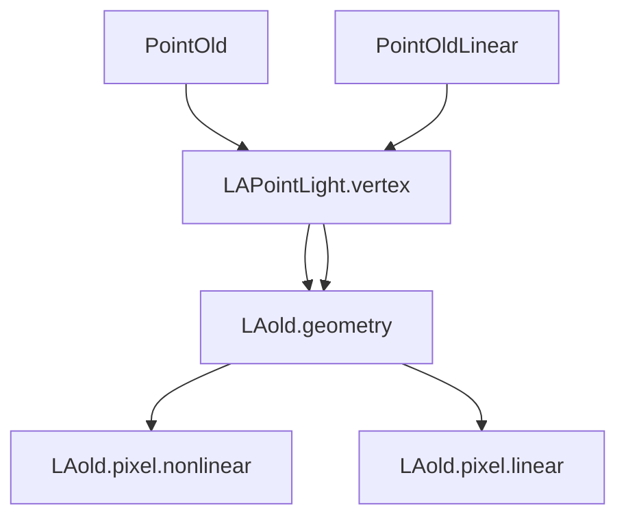
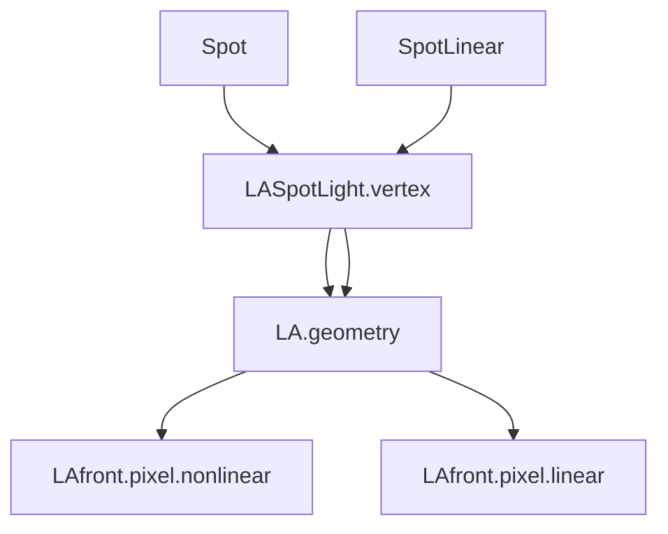

# Clustered Shading Assigning Lights
## Pipeline states

* PointOld and PointOldLinear

```mermaid
graph TB;

PointOld --> LAPointLight.vertex --> LAold.geometry --> LAold.pixel.nonlinear
PointOldLinear --> LAPointLight.vertex --> LAold.geometry --> LAold.pixel.linear

```
* Point and PointLinear

```mermaid

graph TB

Point --> LAPointLight.vertex --> LA.geometry --> LAfront.pixel.nonlinear
PointLinear --> LAPointLight.vertex --> LA.geometry --> LAfront.pixel.linear

```

* LA.compute

```mermaid
graph TB
  LA.compute

```

* SpotOld and SpotOldLinear

```mermaid
graph TB

SpotOld --> LASpotLight.vertex --> LAold.geometry --> LAold.pixel.nonlinear
SpotOldLinear --> LASpotLight.vertex --> LAold.geometry --> LAold.pixel.linear

```

* Spot and SpotLinear

```mermaid
graph TB
Spot --> LASpotLight.vertex --> LA.geometry --> LAfront.pixel.nonlinear
SpotLinear --> LASpotLight.vertex --> LA.geometry --> LAfront.pixel.linear

```
